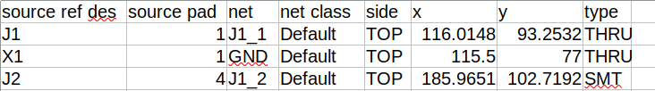

# kicad-testpoints

> **Easily generate production-grade test point reports from your KiCAD PCB files — no scripting or extra tools required.**

## Features

- ✅ Generate bed-of-nails test point reports from KiCAD `.kicad_pcb` files
- ✅ CLI and GUI plugin available
- ✅ Compatible with [TheJigsApp](https://www.thejigsapp.com) jig generation tools
- ✅ Excel/CSV output for manufacturing
- ✅ Two workflows: from KiCAD fab properties or external spreadsheet


CLI to generate a [JigsApp](https://www.thejigsapp.com) compatible test point report for generating bed-of-nails jigs. Specify any pad as a test pad.

Want GUI integration? Check out the [KiCAD Action Plugin →](https://github.com/snhobbs/kicad-testpoints-pcm)

## KiCAD Plugin
This is the command line tool based on reference designator and pad number.
For the action plugin see [snhobbs/kicad-testpoints-pcm](https://github.com/snhobbs/kicad-testpoints-pcm).

The plugin is generates the same report as the CLI except it can be used entirely within the KiCAD user interface (no terminals required) and uses the fabrication property of the pads instead of their pad number and ref des.

### Watch the plugin introduction
[](https://www.youtube.com/embed/Z7aEWe4d0jE)

## How to Use
There are two modes of the CLI:

+ by-fab-setting
+ from-spreadsheet


### By Fab Setting
If using the fab setting then you set the fabrication setting of each desired pad to "test point". Run the CLI with the following arguments to generate a spreadsheet report:

```sh
kicad_testpoints by-fab-setting --pcb <PROJECT>.kicad_pcb  --out test-point-report.xlsx --drill-center
```

### From Spreadsheet
If using a spreadsheet input instead then generate one with the source ref des and source pad then call the CLI like this:

```sh
kicad_testpoints from-spreadsheet --pcb <PROJECT>.kicad_pcb  --points test_points.xlsx --out test-point-report.xlsx --drill-center
```

The CLI will pull out the related pad data and creates the report as a csv.

NOTE: As it is possible to create footprints with multiple pads with the same name this method will take the first matching
pad name.



The generated report is consistent with the [kicad-parts-placer](https://github.com/snhobbs/kicad-parts-placer) CLI tool.

## Installation

### From Source
```sh
git clone https://github.com/snhobbs/kicad-testpoints.git
cd kicad-testpoints
pip install -e .
```

## Links
+ [Blog Post](https://www.thejigsapp.com/blog/2024/06/03/kicad-testpoints-plugin/)
+ [Video Introduction](https://www.youtube.com/watch?v=Z7aEWe4d0jE)
+ [TheJigsApp: Test Point Reports](https://www.thejigsapp.com/docs/test-point-report/).

## Test Points in other EDA Programs
+ [ Altium Designer ](https://www.altium.com/documentation/altium-designer/adding-testpoints-pcb)
+ [Cadence](https://resources.pcb.cadence.com/blog/2020-the-pcb-test-point-and-its-importance-to-circuit-board-manufacturing)
+ [PCB-Investigator](https://manual.pcb-investigator.com/pages/test_point_report)
+ [PADS](https://blogs.sw.siemens.com/electronic-systems-design/2020/04/21/test-point-placement-enhancement-in-pads-professional-vx-2-7/)

For more on generating test point reports see [this post](https://www.thejigsapp.com/docs/test-point-report/).
